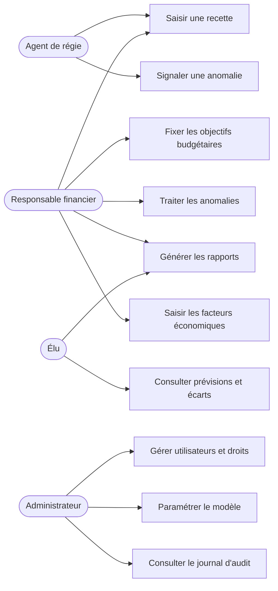
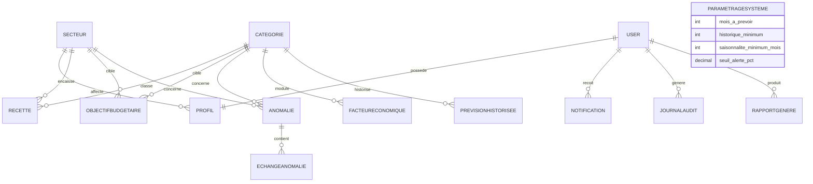
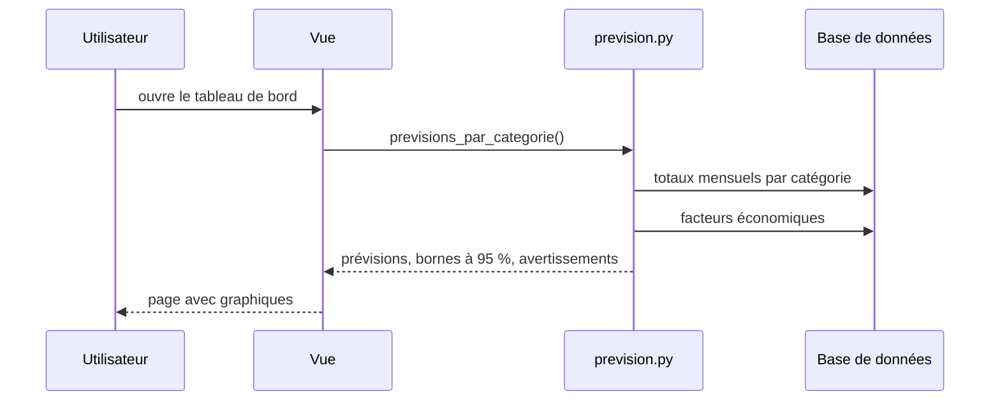

# Modélisation

## Cas d'utilisation

```mermaid
flowchart LR
    Agent([Agent de régie]) --> UC1[Saisir une recette]
    Agent --> UC2[Signaler une anomalie]
    Responsable([Responsable financier]) --> UC1
    Responsable --> UC3[Fixer les objectifs budgétaires]
    Responsable --> UC4[Traiter les anomalies]
    Responsable --> UC5[Générer les rapports]
    Responsable --> UC6[Saisir les facteurs économiques]
    Elu([Élu]) --> UC7[Consulter prévisions et écarts]
    Elu --> UC5
    Admin([Administrateur]) --> UC8[Gérer utilisateurs et droits]
    Admin --> UC9[Paramétrer le modèle]
    Admin --> UC10[Consulter le journal d'audit]
```

## Modèle de données

```mermaid
erDiagram
    USER ||--|| PROFIL : possede
    SECTEUR ||--o{ PROFIL : affecte
    SECTEUR ||--o{ RECETTE : encaisse
    CATEGORIE ||--o{ RECETTE : classe
    CATEGORIE ||--o{ OBJECTIFBUDGETAIRE : cible
    SECTEUR ||--o{ OBJECTIFBUDGETAIRE : cible
    SECTEUR ||--o{ ANOMALIE : concerne
    CATEGORIE ||--o{ ANOMALIE : concerne
    ANOMALIE ||--o{ ECHANGEANOMALIE : contient
    CATEGORIE ||--o{ FACTEURECONOMIQUE : module
    CATEGORIE ||--o{ PREVISIONHISTORISEE : historise
    USER ||--o{ NOTIFICATION : recoit
    USER ||--o{ JOURNALAUDIT : genere
    USER ||--o{ RAPPORTGENERE : produit
    PARAMETRAGESYSTEME {
        int mois_a_prevoir
        int historique_minimum
        int saisonnalite_minimum_mois
        decimal seuil_alerte_pct
    }
```

## Séquence de prévision

```mermaid
sequenceDiagram
    participant U as Utilisateur
    participant V as Vue
    participant P as prevision.py
    participant B as Base de données
    U->>V: ouvre le tableau de bord
    V->>P: previsions_par_categorie()
    P->>B: totaux mensuels par catégorie
    P->>B: facteurs économiques
    P-->>V: prévisions, bornes à 95 %, avertissements
    V-->>U: page avec graphiques
```
